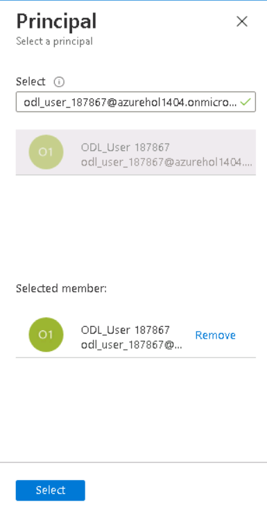
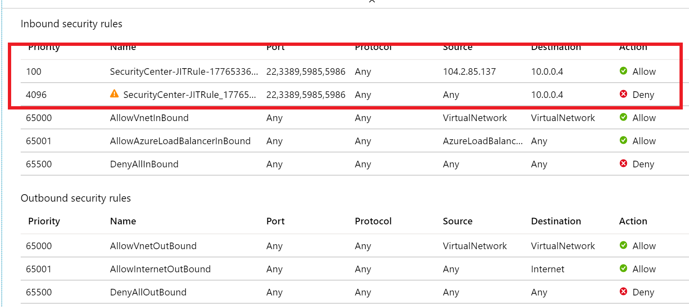
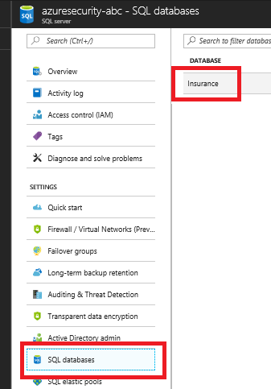
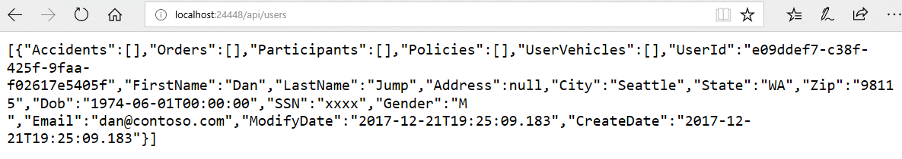

Azure security, privacy, and compliance

Hands-on lab step-by-step

May 2018

Information in this document, including URL and other Internet Web site references, is subject to change without notice. Unless otherwise noted, the example companies, organizations, products, domain names, e-mail addresses, logos, people, places, and events depicted herein are fictitious, and no association with any real company, organization, product, domain name, e-mail address, logo, person, place or event is intended or should be inferred. Complying with all applicable copyright laws is the responsibility of the user. Without limiting the rights under copyright, no part of this document may be reproduced, stored in or introduced into a retrieval system, or transmitted in any form or by any means (electronic, mechanical, photocopying, recording, or otherwise), or for any purpose, without the express written permission of Microsoft Corporation.

Microsoft may have patents, patent applications, trademarks, copyrights, or other intellectual property rights covering subject matter in this document. Except as expressly provided in any written license agreement from Microsoft, the furnishing of this document does not give you any license to these patents, trademarks, copyrights, or other intellectual property.

The names of manufacturers, products, or URLs are provided for informational purposes only, and Microsoft makes no representations and warranties, either expressed, implied, or statutory, regarding these manufacturers or the use of the products with any Microsoft technologies. The inclusion of a manufacturer or product does not imply endorsement of Microsoft of the manufacturer or product. Links may be provided to third-party sites. Such sites are not under the control of Microsoft and Microsoft is not responsible for the contents of any linked site or any link contained in a linked site, or any changes or updates to such sites. Microsoft is not responsible for webcasting or any other form of transmission received from any linked site. Microsoft is providing these links to you only as a convenience, and the inclusion of any link does not imply endorsement of Microsoft of the site or the products contained therein.

© 2018 Microsoft Corporation. All rights reserved.

Microsoft and the trademarks listed at <https://www.microsoft.com/en-us/legal/intellectualproperty/Trademarks/Usage/General.aspx> are trademarks of the Microsoft group of companies. All other trademarks are the property of their respective owners.

**Contents**

<!-- TOC -->

- [Azure security, privacy, and compliance hands-on lab step-by-step](#azure-security-privacy-and-compliance-hands-on-lab-step-by-step)
    - [Abstract and learning objectives](#abstract-and-learning-objectives)
    - [Overview](#overview)
    - [Solution architecture](#solution-architecture)
    - [Requirements](#requirements)
    - [Exercise 1: Implementing Just-In-Time (JIT) access](#exercise-1-implementing-just-in-time-jit-access)
        - [Task 1: Setup virtual machine with JIT](#task-1-setup-virtual-machine-with-jit)
        - [Task 2: Perform a JIT request](#task-2-perform-a-jit-request)
    - [Exercise 2: Securing the Web Application and database](#exercise-2-securing-the-web-application-and-database)
        - [Task 1: Setup the database](#task-1-setup-the-database)
        - [Task 2: Test the web application solution](#task-2-test-the-web-application-solution)
        - [Task 3: Utilize data masking](#task-3-utilize-data-masking)
        - [Task 4: Utilize column encryption with Azure Key Vault](#task-4-utilize-column-encryption-with-azure-key-vault)
    - [Exercise 3: Migrating to Azure Key Vault](#exercise-3-migrating-to-azure-key-vault)
        - [Task 1: Create an Azure Key Vault secret](#task-1-create-an-azure-key-vault-secret)
        - [Task 2: Create an Azure Active Directory application](#task-2-create-an-azure-active-directory-application)
        - [Task 3: Assign Azure Active Directory application permissions](#task-3-assign-azure-active-directory-application-permissions)
        - [Task 4: Install or verify Nuget Package](#task-4-install-or-verify-nuget-package)
        - [Task 5: Test the solution](#task-5-test-the-solution)
    - [Exercise 4: Securing the network](#exercise-4-securing-the-network)
        - [Task 1: Test network security group rules \#1](#task-1-test-network-security-group-rules-\1)
        - [Task 2: Configure network security groups](#task-2-configure-network-security-groups)
        - [Task 3: Test network security group rules \#2](#task-3-test-network-security-group-rules-\2)
        - [Task 4: Install network watcher VM extension](#task-4-install-network-watcher-vm-extension)
        - [Task 5: Setup network packet capture](#task-5-setup-network-packet-capture)
        - [Task 6: Execute a port scan](#task-6-execute-a-port-scan)
    - [Exercise 5: Creating security log alerts](#exercise-5-creating-security-log-alerts)
        - [Task 1: Create a custom alert](#task-1-create-a-custom-alert)
        - [Task 2: Investigate a custom alert](#task-2-investigate-a-custom-alert)
        - [Task 3: Create and run a playbook](#task-3-create-and-run-a-playbook)
    - [Exercise 6: Creating Compliance Reports with Power BI](#exercise-6-creating-compliance-reports-with-power-bi)
        - [Task 1: Export a Power Query formula from Log Analytics](#task-1-export-a-power-query-formula-from-log-analytics)
    - [Exercise 7: Using Compliance Manager](#exercise-7-using-compliance-manager)
        - [Task 1: Use Compliance Manager for Azure](#task-1-use-compliance-manager-for-azure)
    - [After the hands-on lab](#after-the-hands-on-lab)
        - [Task 1: Delete resource group](#task-1-delete-resource-group)
        - [Task 2: Delete lab environment (optional)](#task-2-delete-lab-environment-optional)
    - [Appendix A](#appendix-a)
        - [Task 1: Create storage account](#task-1-create-storage-account)
        - [Task 2: Create virtual networks](#task-2-create-virtual-networks)
        - [Task 3: Create virtual machines](#task-3-create-virtual-machines)
        - [Task 4: Create network security groups](#task-4-create-network-security-groups)
        - [Task 5: Azure SQL server](#task-5-azure-sql-server)
        - [Task 6: Create an Azure key vault](#task-6-create-an-azure-key-vault)

<!-- /TOC -->

# Azure security, privacy, and compliance hands-on lab step-by-step 

## Abstract and learning objectives 

In this hands-on lab, you will implement many of the Azure Security Center features to secure their cloud-based Azure infrastructure (IaaS) and applications (PaaS). Specifically, you will ensure that any internet exposed resources have been properly secured and any non-required internet access disabled. Additionally, you will implement a “jump machine” for admins. with Application Security enabled to prevent admins from installing non-approved software and potentially exposing cloud resources. You will then utilize custom alerts to monitor for TCP/IP Port Scans and then fire alerts and run books based on those attacks.

At the end of this hands-on lab, you will be better able to design and build secure cloud-based architectures, and to improve the security of existing applications hosted within Azure.

## Overview

Contoso is a multinational corporation, headquartered in the United States that provides insurance solutions worldwide. Its products include accident and health insurance, life insurance, travel, home, and auto coverage. Contoso manages data collection services by sending mobile agents directly to the insured to gather information as part of the data collection process for claims from an insured individual. These mobile agents are based all over the world and are residents of the region in which they work. Mobile agents are managed remotely and each regional corporate office has a support staff responsible for scheduling their time based on requests that arrive to the system.??

They are migrating many of their applications via Lift and Shift to Azure and would like to ensure that they can implement the same type of security controls and mechanisms they currently have. They would like to be able to demonstrate their ability to meet compliance guidelines required in the various countries/regions they do business. They have already migrated a web application and database server to their Azure instance and would like to enable various logging and security best practices for administrator logins, SQL Databases, and virtual network design.

## Solution architecture

Contoso administrators recently learned about the Azure Security Center and have decided to implement many of its features to secure their cloud-based Azure infrastructure (IaaS) and applications (PaaS). Specifically, they want to ensure that any internet exposed resources have been property secured and any non-required internet access disabled. They also decided that implementing a "jump machine" for admins with Application Security was also important as they had admins installing non-approved software on their machines and then accessing cloud resources. They also want the ability to be alerted when TCP/IP Port Scans are detected and fire alerts based on those attacks.

The solution begins by creating a jump machine. This jump machine is used to access the virtual machines and other resources in the resource group. All other access is disabled via multiple **virtual networks**. More than one virtual network is required as having a single **virtual network** would cause all resource to be accessible based on the default currently un-customizable security group rules. Resources are organized into these virtual networks. **Azure Center Security** is utilized to do **Just-In-Time** access to the jump machine. This ensures that all access is audited to the jump machine and that only authorized IP-addressed are allowed access, this prevents random attacks on the virtual machines from bad internet actors. Additionally, applications are not allowed to be installed on the jump machine to ensure that malware never becomes an issue. Each of the virtual network and corresponding **network security groups** have logging enabled to record deny events to **Azure Logging**. These events are then monitored by a **custom alert rule** in **Azure Security Center** to fire **custom alerts** which then execute custom **Azure Runbooks**. Once the solution is in place, the **Compliance Manager** tool is utilized to ensure that all GDPR based technical and business controls are implemented and maintained to ensure GDPR compliance.

## Requirements

1.  Microsoft Azure subscription must be pay-as-you-go or MSDN

    a.  Trial subscriptions will not work

2.  A machine with the following software installed:

    b.  Visual Studio 2017

    c.  SQL Management Studio 2017

    d.  Power BI Desktop

## Exercise 1: Implementing Just-In-Time (JIT) access

Duration: 15 minutes

Synopsis: In this exercise, attendees will secure a Privileged Access Workstation (PAW) workstation using the Azure Security Center Just In Time Access feature

### Task 1: Setup virtual machine with JIT

1.  In a browser, navigate to your Azure portal (<https://portal.azure.com>)

2.  Select **Security Center,** then select **Just in time VM access**

    

    **NOTE:** Your subscription may not be set up with the **Standard** tier; if that is the case then do the following:

    -   Select **Security Policy**

    -   Expand the first node to show your subscriptions, select the subscription

    -   Toggle the **Inheritance** setting to **Unique**

    -   Select the **Standard** tier

    -   Select **Save**, note that it may take a few minutes for everything to "light up"

    -   Select **Just in time VM access**

3.  Select the **Recommended** tab, and then check the checkbox to select all the virtual machines, and then select the **Enable JIT on 3 VMs** link

> **NOTE:** It could take up to 5 minutes for new VMs to show up if you upgraded to standard tier security

4.  In the configuration window that opens, review the settings, then select **Save**

    

    You should now see the states change to **Resolved**

### Task 2: Perform a JIT request

1.  Select the **Configured** tab. You should now see all the machines listed.

2.  Select the **paw-1** virtual machine, and then select **Request Access**

    

3.  For each of the ports, select the **On** toggle button

    

4.  At the bottom of the dialog, select **Open ports**. You should now see the **APPROVED** requests have been incremented and the **LAST ACCESS** is set to **Active now.**

    

5.  Select the ellipses, then select **Activity Log**, you will be able to see a history of who requests access to the virtual machines

    

6.  In the Azure Portal main menu, select **Network Security Groups**, then select **paw-1-nsg**

    

7.  Select **Inbound security rules.** You should now see a set of inbound security rules set up by JIT Access

    

## Exercise 2: Securing the Web Application and database

Duration: 45 minutes

Synopsis: In this exercise, attendees will utilize Azure SQL features to data mask database data and utilize Azure Key Vault to encrypt sensitive columns for users and applications that query the database.

### Task 1: Setup the database

1.  Switch to your Azure portal, select **More Services** then select **SQL Servers**

    

2.  Select the **Azure SQL** database server you created using the Azure Manager template

3.  Select **SQL Databases**, then select the **SampleDB** database

    

4.  In the summary section, select the **Show database connection strings**

    

5.  Take note of the connection string for later in this lab, specifically the **Server** parameter:

    

6.  Open **SQL Server Management Studio**

7.  Enter the database server name from above

8.  Enter the username and password used from the Azure Template deployment (**wsadmin** - **p\@ssword1rocks**)

    

9.  Select **Connect**, in the **New Firewall Rule** dialog, select **Sign In**

10. Sign in as your Azure tenant admin

11. In the dialog, select **OK**, notice how your IP address will be added for connection

    

12. Right-click **Databases**, and select **Import Data-tier Application**

    

13. In the Introduction dialog, select **Next**

14. Select **Browse**, navigate to the extracted **Database** directory, and select the **Insurance.dacpac** file

    

15. Select **Open**

16. On the **Import Settings** dialog, select **Next**

17. On the **Database Settings** dialog, select **Next**

> **NOTE:** If you get an error, close and re-open SQL Management Studio try the import again. If that does not work, you may need to download the latest SQL Management Studio from [here](https://docs.microsoft.com/en-us/sql/ssms/download-sql-server-management-studio-ssms?view=sql-server-2017). In some instances the latest version may not work, version 17.3 is known to deploy the package properly.

18. Select **Finish** and the database will deploy to Azure

19. Once completed, select **Close**

    

20. In **SQL Management Studio**, select **File-\>Open-\>File**

    

21. Browse to the extracted GitHub folder, select the **\\Database\\00\_CreateLogin.ps1** file

22. Ensure that the **master** database is selected

23. Run the script to create a login called **agent**

24. Browse to the extracted folder, select the **\\Database\\01\_CreateUser.ps1** file

25. Ensure that the **Insurance** database is selected

26. Run the script to create a non-admin user called **agent**

### Task 2: Test the web application solution

1.  In the extracted directory, double-click the **/WebApp/InsuranceAPI/InsuranceAPI.sln** solution file, and Visual Studio will open

2.  In the **Solution Explorer**, navigate to and double-click the **web.config** file to open it

    

3.  Update the web.config (line 72) to point to the **Insurance** database created in Task 2. You should only need to update the server name to point to your Azure SQL Server.

    

4.  Run the **InsuranceAPI** solution and press **F5**

5.  In the browser window that opens, browse to [http://localhost:portno/api/Users](http://localhost:portno/api/Users) you should see a json response that shows an unmasked SSN column

> **NOTE:** Depending on your browser, you may need to download to view the json response.

### Task 3: Utilize data masking

1.  Switch to the Azure Portal

2.  Select **SQL databases**

3.  Select the **Insurance** database

4.  In the menu, select **Dynamic Data Masking**, then select **+Add Mask**

    

5.  Select the **User** table

6.  Select the **SSN** column

7.  Select **Add**

    

8.  Select **Save**

9.  Switch back to your InsuranceAPI solution, refresh the page, and you should see the SSN column is now masked with **xxxx**

    

10. Close **Visual Studio**

### Task 4: Utilize column encryption with Azure Key Vault

1.  Switch to **SQL Management Studio**

2.  In the extracted directory, navigate to the **Database** directory

3.  Open the **02\_PermissionSetup.sql** file, copy and paste the TSQL to the Query Window

4.  Switch to the **Insurance** database, and execute the SQL statement

5.  In the **Object Explorer**, expand the **Insurance** node

6.  Expand the **Tables** node

7.  Expand the **User** table node

8.  Expand the **Columns** node

9.  Right-click the **SSN** column, and select **Encrypt Column**

    

    Notice that the State of the column is such that you cannot add encryption (data masking):

    

10. Select **Cancel**

11. Switch back to the Azure Portal, and select the User.SSN data masking

12. Select **Delete**

    

13. Select **Save**

14. Switch back to **SQL Management Studio**

15. Right-click the **SSN** column, and select **Encrypt Column**

16. Check the checkbox next to the **SSN** column

17. For the **Encryption Type**, and select **Deterministic**

    

18. Select **Next**

19. For the encryption select **Azure Key Vault** in the dialog

    

20. Select **SignIn**

21. Sign in with your Azure Portal credentials

22. Select your Azure Key Vault

23. Select **Next**

24. On the **Run Settings**, select **Next**

25. Select **Finish**, and the configured will start

> **NOTE:** You may receive a "wrapKey" error. If so, ensure that your account has been assigned those permissions in the Azure Key Vault.

    a.  Select **Key vault**

    b.  Select your key vault

    c.  Select **Access policies**

    d.  Select **Add New**

    e.  Select your account

    f.  Select **Key permissions**, and select **Select all**

    

    g.  Select **Secret permissions**, and select **Select all**

    h.  Select **Certificate permissions**, and select **Select all**

    i.  Select **OK**

    j.  Select **Save**

    k.  Retry the operation

    

<!-- -->

26. Select **Close**

27. Right-click the **User** table, and select **Select top 1000 rows**

    

    You will notice the SSN column is encrypted based on the new Azure Key Vault key.

    

28. Switch to the Azure Portal

29. Select **Key Vaults**

30. Select your Azure Key Vault, and then select **Keys**. You should see the key created from the SQL Management Studio displayed:

    

## Exercise 3: Migrating to Azure Key Vault

Duration: 30 minutes

Synopsis: In this exercise, attendees will learn how to migrate web application to utilize Azure Key Vault rather than storing valuable credentials (such as connection strings) in application configuration files.

### Task 1: Create an Azure Key Vault secret

1.  From the extracted GitHub directory, open the **\\WebApp\\InsuranceAPI\_KeyVault\\InsuranceAPI.sln** solution

2.  Switch to your Azure Portal

3.  Select **Key Vaults**, then select your Azure Key Vault

    

4.  Select **Secrets**, then select **+Add**

5.  For the **Upload Options**, select **Manual**

6.  For the **Name**, enter **InsuranceAPI**

7.  For the **Value,** copy the connection string information from the InsuranceAPI solution web.config file in Exercise 2

8.  Select **Create**

9.  Select **Secrets**

10. Select **InsuranceAPI**

11. Select the current version

    

12. Copy and record the secret identifier URL for later use:

    

### Task 2: Create an Azure Active Directory application

1.  Select **Azure Active Directory**, then select **App Registrations**

    

2.  Select **+****New application registration**

3.  For the name, type **AzureKeyVaultTest**

4.  For the Sign-on URL, type <http://localhost:12345>

    

5.  Select **Create**

6.  Select the new **AzureKeyVaultTest** application

7.  Copy and record the **Application ID** for later use

8.  Copy and record the **Object ID** for later use

    

9.  Select **Settings**

10. Select **Keys**

11. For the description, enter **InsuranceAPI**

12. For the Expires, select **In 1 year**

13. Select **Save**

14. Copy and record the key value for later use

### Task 3: Assign Azure Active Directory application permissions

1.  Switch back to Azure Portal and select your Azure Key Vault

2.  Select **Access Policies**

3.  Select **+****Add New**

    

4.  Select **Select prinicipal**, type **AzureKeyVaultTest**

5.  Select the application service principal, select **Select**

6.  Select the **Secret permissions** drop-down, check the **Get** and **List** permissions

    

7.  Select **OK**

8.  Select **Save**

### Task 4: Install or verify Nuget Package

1.  Switch to **Visual Studio**

2.  In the menu, select **View-\>Other Windows-\>Package Manager Console**

3.  In the new window that opens, run the following commands

    **NOTE**: These already exist in the project but are provided as a reference.

    a.  Install-Package Microsoft.IdentityModel.Clients.ActiveDirectory -Version 2.16.204221202

    b.  Install-Package Microsoft.Azure.KeyVault

4.  From **Solution Explorer**, double-click the **web.config** file to open it

    Notice the **appSettings** section has some token values:

    

5.  Replace the **ClientId** and **ClientSecret** with the values from Task 2

6.  Replace the **SecretUri** with the Azure Key Vault secret key Uri from Task 1

7.  Save the file

### Task 5: Test the solution

1.  Open the **web.config**, and delete the **connectionString** from the file at line 78

2.  Open the **global.asax.cs** file, and place a break point at line 28

> **NOTE:** This code makes a call to get an accessToken as the application you set up above, then make a call to the Azure Key Vault using that accessToken.

3.  Run the solution, and press **F5**

    You should see that you execute a call to Azure Key Vault and get back the secret (which in this case is the connection string to the Azure Database).

    

4.  Press **F5**, and navigate to [http://localhost:portno/api/Users](http://localhost:portno/api/Users), you should get an error. Because you encrypted the column in the previous exercies, EntityFramework is not able to retrieve the value. You would need to add the AzureKeyVaultProvider to the code in order for .NET to handle the encrypted column.

## Exercise 4: Securing the network

Duration: 45 minutes

Synopsis: In this exercise, attendees will utilize Network Security Groups to ensure that virtual machines are segregated from other Azure hosted services and then explore the usage of the Network Packet Capture feature of Azure to actively monitor traffic between networks.

### Task 1: Test network security group rules \#1

1.  In the Azure Portal, select **Virtual Machines**

2.  Select **paw-1**, then select **Connect** (you may have to request JIT access)

> **NOTE:** Default username is **wsadmin** with **p\@ssword1rocks** as password.

3.  In the **PAW-1** virtual machine, open **PowerShell ISE as administrator**

4.  Select File-\>Open, browse to the extracted GitHub directory and open the **\\Scripts \\PortScanner.ps1**

5.  Review the script. It does the following:

    a.  Installs NotePad++

    b.  Adds hosts entries for DNS

> **NOTE:** When using multiple virtual networks, you must setup a DNS server in the Azure tenant

    c.  Executes port scans

<!-- -->

6.  Run the script, and press **F5.** You should see the following (the Azure ARM Template created a default rule to block all traffic):

    a.  Port scan for port 3389 (RDP) to **DB-1** and **WEB-1** is unsuccessful from the **PAW-1** machine

    b.  The information above for port 3389 (RDP) is visible after running the script and pressing F5

    c.  Port scan for port 1433 (SQL) to **DB-1** and **WEB-1** is unsuccessful from the **PAW-1** machine. **DB-1** is running SQL Server but traffic is block at NSG and the windows firewall.

        

    d.  Port scan for port 80 (HTTP) to **DB-1** and **WEB-1** is unsuccessful from the **PAW-1** machine, if traffic was allowed, it would always fail to **DB-1** because it is not running IIS or any other web server

        

### Task 2: Configure network security groups

1.  Switch to the Azure Portal

2.  Configure the database server to only allow SQL Connections from the web server

    a.  Select **Network Security Groups**

    b.  Select **DbTrafficOnly**

    c.  Select **Inbound Security Rules**

    d.  Select **+Add**

    e.  For the **Source**, select **IP Addresses**

    f.  For the **Source IP address**, enter **10.2.0.4**

    g.  For the **Destination port range**, enter **1433**

    h.  For the **priority**, enter **100**

    i.  Select **OK**

3.  Configure the web server to allow all HTTP and HTTPS connections

    a.  Select **Network Security Groups**

    b.  Select **WebTrafficOnly**

    c.  Select **Inbound Security Rules**

    d.  Select **+Add**

    e.  For the **Destination port range**, enter **80,443**

    f.  For the **priority**, enter **100**

    g.  Change the name to **Port\_80\_443**

    h.  Select **OK**

4.  Configure both the database and web server to only allow RDP connections from the PAW machine

    a.  Select **Network Security Groups.** For both the **DbTrafficOnly** and **WebTrafficOnly**, do the following:

        i.  Select **Inbound Security Rules**

        ii. Select **+Add**

        iii. For the **Source**, select **IP Addresses**

        iv. For the **Source IP address**, enter **10.0.0.4**

        v.  For the **Destination port range**, enter **3389**

        vi. For the **priority**, enter **101**

        vii. Select **OK**

5.  Configure all NSGs to have Diagnostic logs enabled

    a.  Select **Network security groups.** For each NSG, do the following:

        i. In the content menu, select **Diagnostic logs**, and then select **Turn on diagnostics**

            

        ii. For the name, enter the NSG name and then add **Logging** to the end

        iii.  Check the **Send to Log Analytics** checkbox

        iv. Select **Create New Workspace.** For the name enter **azuresecurity**

        v. Select your resource group

        vi. Select your location (East US is preferred)

            

        vii. Select **OK**, wait for the OMS workspace to be created

        viii. Select both LOG checkboxes

        ix. Select **Save**

            

### Task 3: Test network security group rules \#2

1.  Switch back to the **PAW-1** virtual machine

2.  Run the script, press **F5**, and you should see the following:

    a.  Port scan for port 3389 (RDP) to **DB-1** and **WEB-1** is successful from the **PAW-1** machine

        

    b.  Port scan for port 1433 (SQL) to **DB-1** is successful, and **WEB-1** is unsuccessful from the **PAW-1** machine

> **NOTE:** You may need to disable the windows firewall on the DB-1 server to achieve this result.

    c.  If IIS has been setup on WEB-1, the port scan for port 80 (HTTP) to **DB-1** is unsuccessful and **WEB-1** is successful from the **PAW-1** machine

    

### Task 4: Install network watcher VM extension

1.  Switch to the Azure Portal

2.  Select **Virtual Machines**

3.  Select **db-1**

4.  Select **Extensions**, then select **+Add**

    

5.  Browse to the **Network Watcher Agent for Windows**, and select it

6.  Select **Create**

    

7.  In the next **Install extension** dialog window (note that it could be blank) select **OK.** You should see a toast notification about the script extension being installed into the Virtual Machine.

    

### Task 5: Setup network packet capture

1.  In the main Azure Portal menu, select **Monitor**

2.  In the context menu, select **Network Watcher**

    

3.  Select the **Overview** link

4.  Expand the subscription region item

5.  For the **East US** region (or whatever region you deployed your VMs too), select the ellipses, then select **Enable Network Watcher**

    

6.  In the new context menu, select **Packet capture**

7.  Select **+Add**

    

8.  For the target virtual machine, ensure that **db-1** is selected

9.  For the capture name, enter **databasetraffic**

10. Notice the ability to save the capture file to the local machine or an Azure storage account. Ensure that the storage account is selected.

    

11. Select **OK**

### Task 6: Execute a port scan

1.  Switch your Remote Desktop connection to the **PAW-1** virtual machine

2.  Uncomment the last line of the script, and press **F5**

    You should see the basic ports scanned, and then a port scan from 80 to 443. This will generate many security center logs for the Network Security Group which will be used in the Custom Alert in the next exercise.

## Exercise 5: Creating security log alerts

Duration: 20 minutes

Synopsis: In this exercise, you will create custom security alerts using the Azure Security Center. The alert will generate the execution of a RunBook using Logic Apps.

### Task 1: Create a custom alert

1.  Open the Azure Portal

2.  Select **Security Center,** then select **Custom alert rules**

> **NOTE:** If you see **Try custom alert rules now**, do the following:

    a.  Select **Security Policy**

    b.  Select the OMS workspace called **azuresecurity**

    c.  Select the **Standard** tier

    

    d.  Select **Save**

    e.  Select **Custom Alert Rules**

    

<!-- -->

3.  Select the **+****New custom alert rule** link

    

4.  For the name, enter **PortScans**

5.  For the description, enter **A custom rule to detect port scans**

6.  In the Search Query text box, type **search \* \| where Type != \'AzureMetric\' and OperationName == \'NetworkSecurityGroupCounters\' and type\_s == \'block\' and direction\_s == \'In\' and Resource == \'WEBTRAFFICONLY\'**

> **NOTE:** If you were quick going through the labs, then you may not have log data in the OMS workspace just yet that corresponds to "AzureMetric". You may need to wait 15-30 minutes before a query will execute.
>
> **NOTE:** Please be sure that you type the query correctly. Due to this being a preview feature, you might not be able to "edit" the alert after it is created.

7.  For the period, select **Over the last 1 hours**

8.  For the evaluation, select **Every 5 minutes**

> **NOTE**: This is so that our lab will run quickly and may not be appropriate for real world.

9.  For the threshold, enter **50**

10. For the suppress alerts, enter **60**

    

11. Select **OK**

### Task 2: Investigate a custom alert

1.  In the main menu, select **Security Center**

2.  Select **Security Alerts**

3.  Select the new **PortScans** alert

    

> **NOTE:** It may take 15-20 minutes for the alert to fire. You can continue to execute the port scan script to cause log events or you can lower the threshold for the custom alert.

4.  Select one of the rows displayed

    

5.  You will see the information about the alert that was fired, at some point you will also be able to execute investigations and playbooks against the alert instances:

    

### Task 3: Create and run a playbook

1.  In the **Security Center** blade, select **Playbooks (Preview)**

    

2.  In the new window, select **Add Playbook**

    

3.  The **Create logic app** dialog will display:

4.  For the name, enter **Email**

5.  Select your existing resource group

6.  Toggle the **Log Analytics** to **On** and then select your **azuresecurity** OMS workspace

    

7.  Select **Create**, and the Logic Apps designer will load

8.  Select the **Send notification email** template

    

9.  Select **Use this template**

    

10. Select **Sign In**, and then type your Azure/O365 credentials

    

> **NOTE:** This would need to be a valid Office 365 account

11. Select **Continue**

12. For the email address, enter your email

13. Select **Save**. You now have an email alert action based on PowerApps for your custom security alert

    

## Exercise 6: Creating Compliance Reports with Power BI

Duration: 20 minutes

Synopsis: In this exercise, attendees will learn to utilize the Log Analytics feature of Azure to create Power BI Reports.

### Task 1: Export a Power Query formula from Log Analytics

1.  Select **Monitor**, then select **Log Analytics**

    

2.  Select **All collected data**

    

3.  In the **Log Search** dialog, select the **Power BI** link

    

4.  Select **Open**, a text document with the Power Query M Language will be displayed

5.  Follow the instructions in the document to execute the query in Power BI

    

6.  Close **Power BI**

## Exercise 7: Using Compliance Manager

Duration: 15 minutes

Synopsis: In this exercise, attendees will learn to navigate the Compliance Manager to explore the various documents that describe the compliance and trust.

### Task 1: Use Compliance Manager for Azure

1.  In a browser, go to the Service Trust/Compliance Manager portal (<https://servicetrust.microsoft.com>)

2.  In the top corner, select **Sign in**, you will be redirected to the Azure AD login page

    

3.  Select or sign in with your Azure AD\\Office 365 credentials

4.  Select the **LAUNCH COMPLIANCE MANAGER** link

5.  Select on the **+Add Assessment** link

6.  For the product dropdown, select **Azure**

7.  For the certification dropdown, select **GDPR**

    

8.  Select **Add to Dashboard.** You will now see a new assessment for Azure and GDPR in progress:

    

9.  Select **Azure GDPR**

10. Review the various controls that you can implement:

11. Scroll to the top of the web page and select **Service Trust Portal**, then scroll to the bottom of the page. Notice the two other main sections of the trust center called: **Audit Reports** and **Trust Documents.**

12. Select **Audit Reports**

    

13. Notice the various tabs that you can select from, select **FedRAMP**

14. These are all the FedRAMP reports sorted by date that have been preformed and publicly posted for Azure customer review. Select the item displayed and briefly review the document.

    

15. Switch back to the Service Trust Portal web page. In the top navigation, select **Service Trust Portal**, and then select **Trust Documents** at the bottom of the page.

16. These are all the various guides and white papers that describe how Azure achieves various levels of compliance

## After the hands-on lab 

Duration: 10 minutes

In this exercise, attendees will deprovision any Azure resources that were created in support of the lab.

### Task 1: Delete resource group

1.  Using the Azure portal, navigate to the Resource group you used throughout this hands-on lab by selecting **Resource groups** in the menu

2.  Search for the name of your research group, and select it from the list

3.  Select **Delete** in the command bar, and confirm the deletion by re-typing the Resource group name and selecting **Delete**

### Task 2: Delete lab environment (optional)

1.  If you are using a hosted platform, make sure you shut it down or delete it

You should follow all steps provided *after* attending the Hands-on lab.

## Appendix A

Appendix A outlines the detailed steps involved in manually creating the resources provisioned by the Lab ARM template. The ARM template creates virtual networks, virtual machine, storage accounts, and a SQL Azure database.

### Task 1: Create storage account

-   Create a single storage account for VMs and other resource to utilize

### Task 2: Create virtual networks

-   Create the following Virtual Networks:

    -   dbVnet -- subnet of 10.1.0.0

    -   mainVnet-- subnet of 10.0.0.0

    -   webVnet-- subnet of 10.2.0.0

-   Ensure that virtual network peerings exist

    -   Db\<-\>Main

    -   Web\<-\>Main

### Task 3: Create virtual machines

-   Create the following Virtual Machines:

<!-- -->

-   PAW-1 -- A2 instance, Windows Server

-   DB-1 -- A2 instance, Windows Server with SQL Server -- be sure to open the windows firewall for port 1433 traffic

-   WEB-1-- A2 instance, Windows Server -- Install IIS

### Task 4: Create network security groups

-   Create the following NSGs

    -   DbTrafficOnly -- assigned to the DB-1 nic

    -   Paw-1-nsg -- assigned to the PAW-1 nic

    -   WebTrafficOnly -- assigned to the WEB-1 nic

<!-- -->

-   For the DBTrafficOnly and WebTrafficOnly, add an incoming rule with priority 1000 that denies all traffic.

### Task 5: Azure SQL server

-   Create an instance of Azure SQL Server

### Task 6: Create an Azure key vault

-   Create an instance of azure key vault

